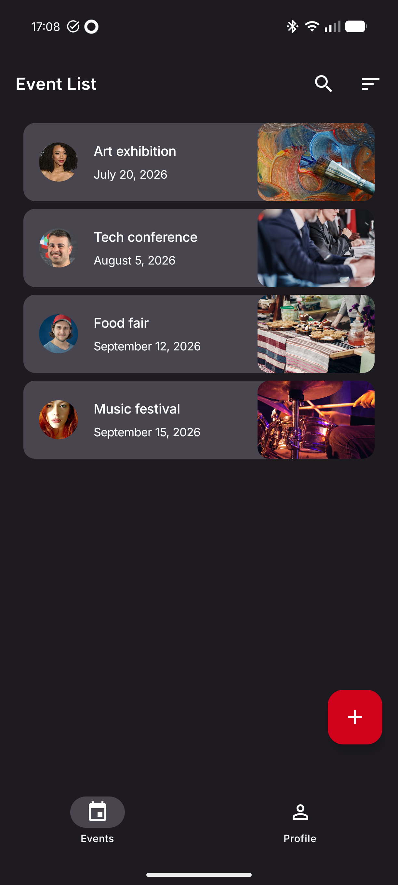
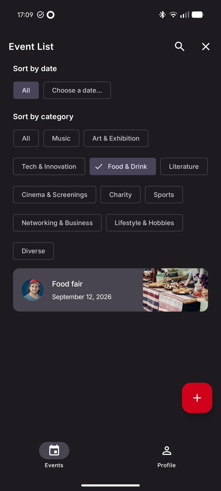
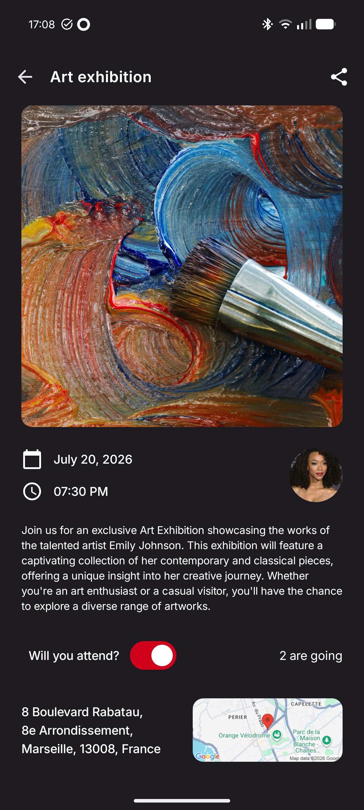
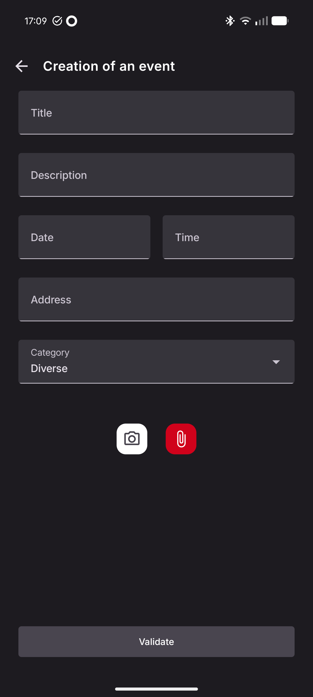

# Projet 15 - Developpez une interface utilisateur liée à une base de données : Eventorias 

## 📌 Présentation du Projet
**Eventorias** est une application Android moderne développée dans le cadre de **la formation développeur d'application Android d'OpenClassrooms**. Il s'agit d'une application de gestion d'évènements communautaires. L'objectif est de concevoir une interface complexe, dynamique et accessible, synchronisée en temps réel avec une base de données Firebase.

L'application permet aux utilisateurs de découvrir des événements, de consulter les détails (localisation via Google Maps Static), d'indiquer leur participation et de créer leurs propres événements en tant que "Promoteur".

---

## 📸 Aperçu
| Liste des événements | Exemple de filtre | Détails de l'événement | Ajout d'un évènement |
|:---:|:---:|:---:|:---:|
|  |  |  |  |

---

## 🎯 Objectifs Pédagogiques
- **UI Réactive & Accessible** : Composants interactifs avec Jetpack Compose respectant les standards d'accessibilité (TalkBack, contrastes).
- **Architecture Robuste** : Mise en œuvre d'une **Clean Architecture** (Data, Domain, UI).
- **Sécurité & Authentification** : Gestion des accès utilisateurs via Firebase Auth.
- **Gestion des données** : Synchronisation Cloud (Firestore) et stockage local des préférences (DataStore).

---

## 🛠 Stack Technique
- **Langage** : Kotlin
- **UI** : Jetpack Compose
- **Architecture** : Clean Architecture + MVVM
- **Injection de Dépendances** : Hilt
- **Backend (Firebase)** : 
    - **Authentication** : Connexion Email & Google via FirebaseUI.
    - **Cloud Firestore** : Base de données NoSQL temps réel.
    - **Firebase Storage** : Stockage des images.
    - **Cloud Messaging** : Notifications push.
- **Navigation** : Compose Destinations (Raamcosta)
- **Stockage Local** : Jetpack DataStore (Preferences) pour les réglages.
- **Images** : Coil & Google Maps Static API.
- **Asynchronisme** : Coroutines & Flow.

---

## 🧩 Fonctionnalités
- **Authentification** : Inscription et connexion sécurisées.
- **Flux d'Événements** : Liste dynamique, filtrage par catégorie et tri par date.
- **Détails** : Descriptions complètes et visualisation géographique. Possibilité de partager à d'autre utilisateur.
- **Participation** : Système de gestion des invités simple.
- **Création** : Formulaire avec upload d'image depuis la galerie ou directement depuis l'appareil photo et sélecteurs de date/heure (DateTimeSelector).
- **Profil** : Gestion des infos personnelles et switch des notifications (via `SettingsStorage`).

---

## ⚙️ Configuration & Installation
Pour des raisons de sécurité, les fichiers de configuration Firebase ne sont pas inclus dans ce dépôt.

1. Créez un projet sur la [Console Firebase](https://console.firebase.google.com/).
2. Ajoutez une application Android avec le nom de package `com.openclassroom.eventorias`.
3. Téléchargez le fichier `google-services.json` et placez-le dans le répertoire `/app`.
4. Activez **Authentication** (Email & Google), **Firestore** et **Storage**.
5. Ajoutez votre clé API Google Maps dans le fichier `local.properties` :

---

## 🏗 Architecture & Qualité
### 🌱 Green Code
Optimisation des appels réseau : les données ne sont rechargées que si nécessaire, en utilisant le cache du ViewModel et de Firestore pour limiter la consommation de données et de batterie.

### 🧪 Stratégie de Tests
- **Tests Unitaires** : Logique métier et Use Cases avec JUnit 5 et Mockk.
- **Tests d'UI** : Validation des parcours critiques avec JUnit 4 et Compose Test Rule.

---

## 🔍 Limites et Perspectives
- **Compte** : La suppression de compte n'est pas implémentée (nécessite une logique administrative au niveau de firebase afin de respecter les critères de RGPD).
- **Édition** : La modification d'un événement après publication est une évolution nécessaire mais pas actuellement implémenter car n'était pas prévue dans le cahier des charges.
- **Gestion** : La création d'un écran pour les promoters afin de consulter la liste des participants ou des informations statistiques sur leurs évènements peut être une évolution intéressante.
- **Évolutions** : Passage au **Multi-module** et ajout d'un mode **Offline** complet avec Room.

---

## 👤 Auteur
**Laury PRIN** – Étudiant Développeur Android.
*Projet réalisé dans un cadre pédagogique (OpenClassrooms).*
